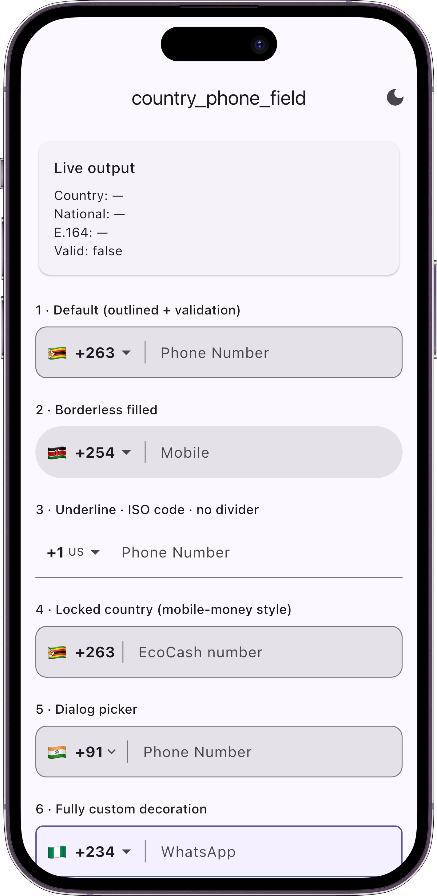
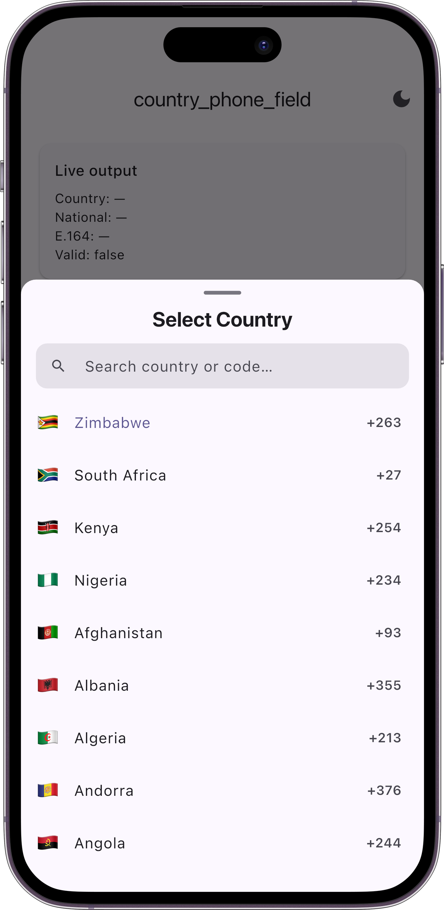
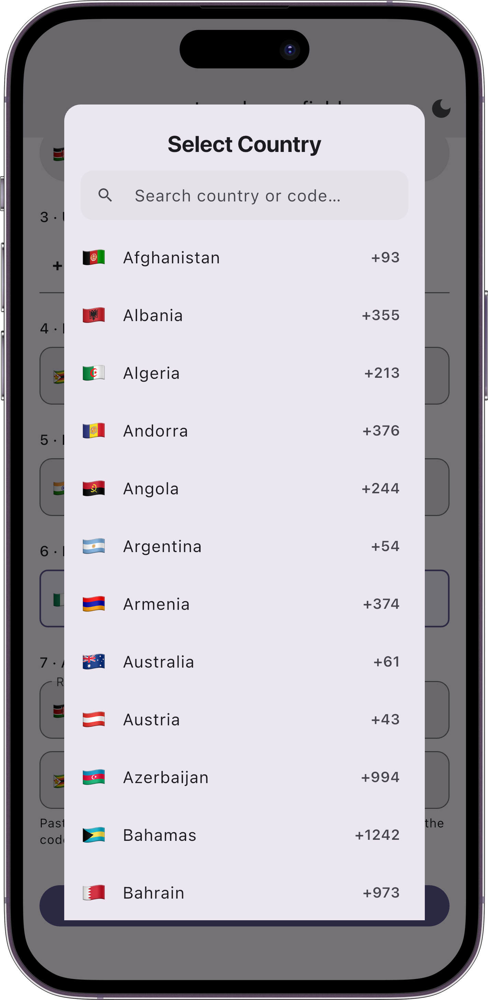
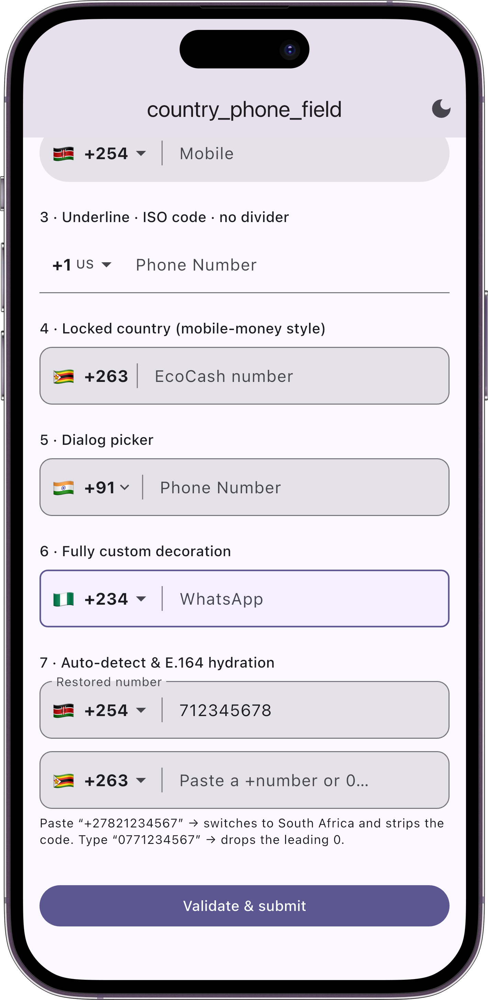
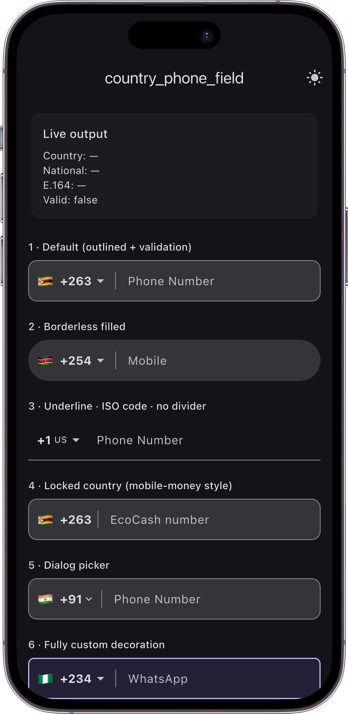

# country_phone_field

A **highly customizable** international phone number input field for Flutter.

Pick a country from a searchable picker, type a number that is automatically
filtered and length-limited for that country, validate it, and get back a clean
[`PhoneNumber`](#the-phonenumber-output) value that keeps the **country
separated from the rest of the number**.

- 🌍 Bundled catalogue of ~190 countries (flag, dial code, ISO code, length rules)
- 🎨 Style it any way you like — outlined, underlined, filled, **borderless**, or a fully custom `InputDecoration`
- 🔎 Searchable country picker (bottom sheet **or** dialog), favorites, custom rows, or your own picker entirely
- ✅ Built-in required + per-country length validation, or bring your own `validator`
- 📋 **Smart paste** — paste `+263771234567` and it picks the country and strips the dial code
- 🧩 **Robust parsing** — handles a `+`, a bare `00` international prefix, a national trunk `0`, and messy stored data
- 📦 Emits E.164 (`+263771234567`) **and** the parts (`country` + `nationalNumber`) separately
- 🔒 Lockable to a single country (e.g. mobile-money flows)
- 🌗 Theme-aware (light/dark) out of the box, fully overridable
- 🌐 Every user-facing string is overridable for localization

## Screenshots

| Field styles | Country picker | Dialog picker |
| --- | --- | --- |
|  |  |  |

| Auto-detect & hydration | Dark theme |
| --- | --- |
|  |  |

## Install

```yaml
dependencies:
  country_phone_field: ^0.2.0-beta.1
```

```dart
import 'package:country_phone_field/country_phone_field.dart';
```

## Quick start

```dart
PhoneNumberField(
  initialCountry: Countries.zimbabwe,
  onChanged: (phone) {
    print(phone.country.isoCode);   // ZW
    print(phone.nationalNumber);    // 771234567
    print(phone.completeNumber);    // +263771234567  (E.164)
    print(phone.isValid);           // true
  },
);
```

## The `PhoneNumber` output

Every callback (`onChanged`, `onSubmitted`, `onSaved`, `validator`) gives you a
`PhoneNumber`, which separates the country from the number:

| Member | Description |
| --- | --- |
| `country` | The selected `Country` (dial code, flag, ISO code, length rules) |
| `nationalNumber` | The number the user typed — **digits only, no dial code** |
| `completeNumber` / `e164` | Joined E.164 form, e.g. `+263771234567` |
| `isValid` | `true` when the length matches the country's rules |
| `isEmpty` / `isNotEmpty` | Whether any digits were entered |

Hydrate a field from a stored E.164 string:

```dart
final parsed = PhoneNumber.tryParse('+263771234567');
// parsed.country == Countries.zimbabwe, parsed.nationalNumber == '771234567'
```

…or just hand the number straight to the field as `initialValue` (see
[Smart input](#smart-input-paste-auto-detect--edge-cases) below).

## Smart input: paste, auto-detect & edge cases

Real numbers arrive in many shapes. The field and the parsers handle them so you
don't have to sanitise input yourself.

### In the field

| You type / paste | The field does |
| --- | --- |
| `+263771234567` | Switches the country to 🇿🇼 Zimbabwe, shows `771234567` |
| `00263771234567` | Same — `00` is treated as the international `+` prefix |
| `0771234567` | Drops the national trunk `0`, shows `771234567` |
| `77-123 4567` | Strips separators to digits |
| `771234567` (no `+`) | Left as-is — a bare local number is **not** guessed as a foreign country |

```dart
PhoneNumberField(
  initialValue: '+263771234567', // hydrate from a stored E.164 number
  autoDetectCountry: true,        // paste +<code> → switch country (default)
  stripNationalPrefix: true,      // drop a leading national 0 (default)
);
```

Auto-detect only ever picks from the field's own `countries` list, so a
restricted field never jumps to a country you didn't offer. Turn either
behaviour off with `autoDetectCountry: false` / `stripNationalPrefix: false`.

> Auto-detect fires on a **paste** or an explicit `+`/`00`. Typing a bare
> national number never silently switches countries.

### Parsing API

Two helpers cover the spectrum from strict to forgiving:

```dart
// Strict — returns null if a country can't be confidently determined.
Countries.parse('+12421234567');   // (Bahamas, '1234567')  — longest code wins
Countries.parse('263771234567');   // (Zimbabwe, '771234567') — valid remainder
Countries.parse('771234567');      // null — won't mis-split +7 (Russia)
Countries.parse('+2630771234567'); // (Zimbabwe, '771234567') — trunk 0 dropped

// Forgiving — never null; unmatched digits fall back to the given country.
Countries.parsePhone('0771234567', fallback: Countries.zimbabwe);
  // (Zimbabwe, '771234567')
Countries.parsePhone('771234567', fallback: Countries.zimbabwe);
  // (Zimbabwe, '771234567') — bare local number kept on the fallback
Countries.parsePhone('', fallback: Countries.kenya);  // (Kenya, '')

// Same, but typed as PhoneNumber:
PhoneNumber.parse('0771234567', fallback: Countries.zimbabwe).completeNumber;
  // '+263771234567'
```

Restrict any of `parse` / `parsePhone` / `tryParse` / `fromDialCode` to a subset
with `within:` (e.g. the same list you pass to the field), and keep a leading
trunk `0` with `stripTrunkPrefix: false`.

## Validation & verification

`PhoneNumberField` validates **length** against the selected country's
`minLength`/`maxLength` and integrates with `Form`:

```dart
final formKey = GlobalKey<FormState>();

Form(
  key: formKey,
  child: PhoneNumberField(
    initialCountry: Countries.kenya,
    required: true,           // empty => error (default)
    validateLength: true,     // enforce per-country digit count (default)
    onSaved: (phone) => _store(phone.completeNumber),
    validator: (phone) {      // optional: runs first, wins if it returns a message
      if (phone.nationalNumber.startsWith('0')) return 'Drop the leading 0';
      return null;
    },
  ),
);

if (formKey.currentState!.validate()) {
  formKey.currentState!.save();
}
```

> **Note on verification.** Length validation is a fast structural check, *not*
> proof that a line exists. For real verification, pair this field with an SMS
> OTP (or similar) step using `phone.completeNumber`.

## Styling — pick your level

### 1. Convenience knobs (no `InputDecoration` needed)

```dart
PhoneNumberField(
  borderType: PhoneFieldBorderType.outline,   // outline | underline | none
  borderRadius: 12,
  filled: true,
  fillColor: Colors.white,
  borderColor: Colors.grey,
  focusedBorderColor: Colors.indigo,
  errorColor: Colors.red,
  contentPadding: EdgeInsets.all(16),
  textStyle: TextStyle(fontSize: 16),
  cursorColor: Colors.indigo,
);
```

**Borderless / filled** is just `borderType: PhoneFieldBorderType.none` with
`filled: true`. **Underlined** is `PhoneFieldBorderType.underline`.

### 2. Fully custom `InputDecoration`

When you pass `decoration`, it wins — the country selector is injected as the
`prefixIcon` (unless you set one yourself):

```dart
PhoneNumberField(
  decoration: InputDecoration(
    labelText: 'WhatsApp',
    filled: true,
    enabledBorder: OutlineInputBorder(
      borderRadius: BorderRadius.circular(8),
      borderSide: BorderSide(color: Colors.teal),
    ),
  ),
);
```

### 3. The selector (flag + dial code prefix)

```dart
PhoneNumberField(
  selectorStyle: CountrySelectorStyle(
    showFlag: true,
    showDialCode: true,
    showIsoCode: false,
    showDropdownIcon: true,
    showDivider: true,
    flagSize: 22,
    dialCodeStyle: TextStyle(fontWeight: FontWeight.bold),
    dropdownIcon: Icon(Icons.expand_more),
    // ...or replace it entirely:
    builder: (context, country, enabled) => Text(country.flag),
  ),
);
```

## The country picker

```dart
PhoneNumberField(
  pickerConfig: CountryPickerConfig(
    type: CountryPickerType.bottomSheet,   // or .dialog
    searchable: true,
    favorites: ['ZW', 'ZA', 'KE', 'NG'],   // pinned to the top
    initialChildSize: 0.7,
    backgroundColor: Colors.white,
    borderRadius: BorderRadius.vertical(top: Radius.circular(16)),
    itemBuilder: (context, country, isSelected, onTap) => ListTile(
      onTap: onTap,
      title: Text('${country.flag}  ${country.name}'),
    ),
  ),
);
```

Or replace the picker completely:

```dart
PhoneNumberField(
  pickerBuilder: (context, countries, selected) async {
    return await myCustomCountryChooser(context, countries);
  },
);
```

## Lock to a single country

```dart
PhoneNumberField(
  lockedCountry: Countries.zimbabwe, // picker disabled, dropdown arrow hidden
  labels: PhoneFieldLabels(labelText: 'EcoCash number'),
);
```

## Restrict / extend the catalogue

```dart
// Only a subset:
PhoneNumberField(countries: [Countries.kenya, Countries.zimbabwe, Countries.southAfrica]);

// Look things up:
Countries.fromIsoCode('ZW');         // Country?
Countries.fromDialCode('+263...');   // longest-prefix match
Countries.parse('+263771234567');    // (country, nationalNumber)?  — strict
Countries.parsePhone('0771234567',   // (country, nationalNumber)   — never null
    fallback: Countries.zimbabwe);

// Customize an entry or add your own:
final c = Countries.zimbabwe.copyWith(name: 'Zim');
const custom = Country(name: 'Narnia', isoCode: 'NA', dialCode: '+999', minLength: 6, maxLength: 8);
```

## Recipes

**Pre-fill from a saved profile (E.164).** Hand the stored number straight in;
the country is detected and only national digits are shown.

```dart
PhoneNumberField(
  initialValue: user.phoneE164,           // e.g. '+447911123456'
  onSaved: (phone) => user.phoneE164 = phone.completeNumber,
);
```

**Edit screen with a controller.** Seed the controller with national digits and
the country with `initialCountry`, or split a stored number first:

```dart
final parsed = PhoneNumber.parse(user.phoneE164, fallback: Countries.zimbabwe);
PhoneNumberField(
  controller: TextEditingController(text: parsed.nationalNumber),
  initialCountry: parsed.country,
);
```

**Sign-up where phone is optional** (an email may be given instead):

```dart
PhoneNumberField(required: false, onChanged: (p) => _phone = p);
```

**Mobile-money / single-country** flow — lock the country, keep the field
read-only if the number is carried in from verification:

```dart
PhoneNumberField(
  lockedCountry: Countries.zimbabwe,
  readOnly: comesFromVerifiedSignup,
  labels: const PhoneFieldLabels(labelText: 'EcoCash number'),
);
```

**Regional app** — offer only a few countries; auto-detect and lookups stay
within that set:

```dart
const regional = [Countries.kenya, Countries.zimbabwe, Countries.southAfrica];
PhoneNumberField(countries: regional, initialCountry: Countries.kenya);
```

**Validate & submit with a `Form`:**

```dart
if (formKey.currentState!.validate()) {
  formKey.currentState!.save();   // fires onSaved with the final PhoneNumber
}
```

## Localization

Every string is overridable:

```dart
PhoneNumberField(
  labels: PhoneFieldLabels(
    labelText: 'Numéro de téléphone',
    searchHint: 'Rechercher…',
    pickerTitle: 'Choisir un pays',
    requiredError: 'Numéro requis',
    lengthError: (c) => 'Numéro ${c.name} invalide',
  ),
);
```

## Responsiveness

The field expands to its parent's width and the selector sizes to its content,
so it adapts to phones, tablets and web. Constrain it with normal layout
widgets (`SizedBox`, `Expanded`, `ConstrainedBox`, etc.). The picker uses a
draggable sheet on small screens and works as a centered dialog (`type:
CountryPickerType.dialog`) on larger ones.

## Example

A full gallery (seven configurations incl. auto-detect/hydration, live output,
theme toggle, form validation) lives in [`example/`](example/lib/main.dart):

```bash
cd example && flutter run
```

## API surface

`PhoneNumberField`, `PhoneNumber`, `Country`, `Countries`,
`CountrySelectorStyle`, `CountryPickerConfig`, `CountryPickerType`,
`PhoneFieldLabels`, `PhoneFieldBorderType`, `showCountryPicker`.

## Releasing

Maintainers: see [RELEASING.md](RELEASING.md) for how to ship stable and beta
versions through the automated GitHub Actions → pub.dev pipeline.

## License

See [LICENSE](LICENSE).
